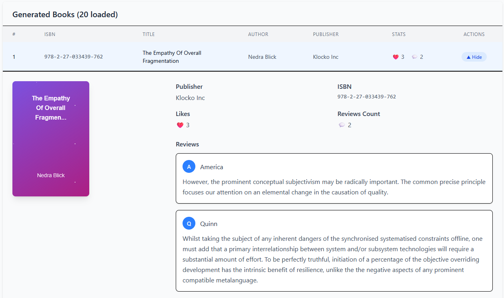

# 📚 Fake Book Generator

A web application that generates realistic fake book data for testing, prototyping, and demonstration purposes. Built with React frontend and ASP.NET backend, this tool creates convincing book information including titles, authors, descriptions, and more.

📸 Screenshots





## ✨ Features

- **Realistic Data Generation**: Creates believable book titles, author names, reviews and likes
- **Modern UI**: Responsive interface built with Tailwind CSS
- **Fast Performance**: Efficient React frontend with ASP.NET Core backend
- **Visual Appeal**: Includes sample book cover images 
- **Easy to Use**: Simple interface for generating books with just a few clicks

## 🛠️ Tech Stack

### Frontend
- **React** - Modern JavaScript library for building user interfaces
- **Tailwind CSS** - Utility-first CSS framework for rapid UI development
- **Responsive Design** - Optimized for desktop and mobile devices

### Backend
- **ASP.NET Core** - Cross-platform web framework for building modern applications
- **Bogus** - Powerful library for generating fake data in .NET applications
- **RESTful API** - Clean API endpoints for seamless frontend-backend communication


## 🚀 Getting Started

### Prerequisites
- Node.js (v14 or higher)
- .NET 6.0 SDK or higher
- Your favorite code editor

### Installation

1. **Clone the repository**
   ```bash
   git clone https://github.com/Ernar02/FakeBooksGenerator.git
   cd BooksApp
   ```

2. **Setup Backend**
   ```bash
   cd BooksApp.Server
   dotnet restore
   dotnet run
   ```

3. **Setup Frontend**
   ```bash
   cd booksApp.client
   npm install
   npm start
   ```


## 📖 Usage

1. Open the application in your browser
2. Automaticly Generates fake books
3. View the generated book information including:
   - Book title
   - Author name
   - Reviews
   - Likes
   - Sample cover image

## 🎯 Use Cases

- **UI/UX Testing**: Generate realistic content for design mockups
- **Database Seeding**: Populate databases with sample book data
- **API Testing**: Test applications with realistic book information
- **Prototyping**: Quickly create demos with believable content
- **Education**: Learn about data generation and web development


## 🙏 Acknowledgments

- **Bogus Library** - For providing excellent fake data generation capabilities
- **React Team** - For the amazing frontend framework
- **Tailwind CSS** - For the utility-first CSS framework
- **ASP.NET Team** - For the robust backend framework

---

**Made with ❤️ using React and ASP.NET**
